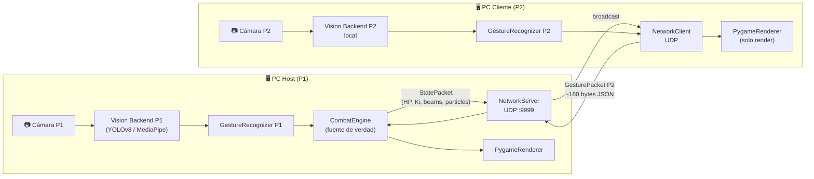

# 🕹️ VideoGame Pose Combat — Análisis Técnico Completo & Backlog v1.0

> **Proyecto:** `videogame_pose` | **Stack:** Python 3.12 + Pygame-CE + YOLOv8 / MediaPipe
> **Fecha:** 2026-09-30 | **Rol:** Software Factory Architect + AI Integration Specialist

---

## ✅ PASO 0 — Verificación del Portafolio

La foto de la usuario fue eliminada del portafolio exitosamente:
- `index.html` → Hero visual reemplazado por **tarjeta terminal** con `whoami`, `cat stack.json`, `git status`
- Nav bar → Iniciales **"MA"** en círculo sage-green (sin imagen de persona)
- **Ninguna foto de persona visible** en el sitio

---

## 📊 1. Estado Actual del Código (Análisis de Código Real)

### Arquitectura actual

```
main.py (orquestador)
├── src/vision/
│   ├── backend.py          # Interfaces PosePlayer, Keypoint, PoseEstimationBackend
│   ├── yolo_adapter.py     # YOLOv8n-pose (6.8MB modelo)
│   ├── mediapipe_adapter.py # MediaPipe Tasks API (partición ROI por columnas)
│   └── synthetic_adapter.py # Backend mock determinista (para tests)
├── src/gestures/
│   └── recognizer.py       # GestureRecognizer con debounce de votación mayoritaria
├── src/game/
│   └── combat.py           # CombatEngine, Fighter, LaserBeam, Particle
├── src/audio/
│   └── sound_engine.py     # SoundEngine: 7 efectos sintetizados con numpy
└── src/ui/
    └── renderer.py         # PygameRenderer: HUD, partículas, beam struggle, overlays
```

### Gestos actuales detectados

| Gesto | Trigger (heurístico) | Acción en juego |
|-------|---------------------|-----------------|
| `KAMEHAMEHA` | Manos juntas + brazos proyectados al frente | Disparo de rayo láser |
| `SHIELD` | Muñecas en guardia alta, juntas | Bloqueo (reduce daño) |
| `CHARGE_KI` | Muñecas bajas + codos abiertos hacia afuera | Recarga energía Ki |
| `PUNCH` | Un brazo extendido, el otro recogido | Golpe melee |
| `IDLE` | Postura neutral | Sin acción |

### Fortalezas del código actual
- ✅ Patrón **Strategy** limpio para intercambiar backend de visión
- ✅ Sistema de partículas con física por `dt` (independiente de FPS)
- ✅ **Beam Struggle** funcional con empuje proporcional al Ki
- ✅ Audio procedimental sin archivos externos (100% numpy)
- ✅ Suavizado temporal de gestos por votación mayoritaria (debounce 3 frames)
- ✅ Tests automatizados en 5 módulos

---

## 🔍 2. Análisis de Oportunidades de Mejora

### 2.1 🌐 Multijugador LAN (Una PC por jugador)

**Estado actual:** Todo ocurre en **1 PC + 1 cámara**. MediaPipe divide la imagen en columnas ROI, lo que requiere que ambos jugadores estén frente a la **misma cámara**.

**Problema técnico raíz:** El módulo `mediapipe_adapter.py` usa `frame[:, x_start:x_end]` para detectar a cada jugador en su mitad de la pantalla. Si los jugadores están en PCs distintas, cada uno tiene su propio stream de cámara.

**Solución propuesta: Arquitectura Cliente-Servidor UDP/JSON sobre LAN**

```
┌──────────────────────────┐         LAN          ┌──────────────────────────┐
│  PC Jugador 1 (HOST)     │ ←── UDP port 9999 ──→ │  PC Jugador 2 (CLIENT)   │
│  main.py --mode host     │                       │  main.py --mode client   │
│                          │                       │                          │
│  [Cámara local]          │                       │  [Cámara local]          │
│  [Visión local P1]       │                       │  [Visión local P2]       │
│  [Motor de combate]      │                       │  [Solo renderer]         │
│  [Renderizado completo]  │                       │  [Renderizado completo]  │
└──────────────────────────┘                       └──────────────────────────┘
```

**Flujo de datos (30 paquetes/seg, ~180 bytes/paquete JSON):**
1. HOST: detecta P1 localmente → corre motor de combate → **envía estado global** al CLIENT
2. CLIENT: detecta P2 localmente → **envía gestos de P2** al HOST
3. HOST: integra gestos P2 → actualiza física → **broadcast del estado** a CLIENT
4. Ambos renderizan el mismo estado recibido

**Complejidad estimada:** Alta (3-4 semanas), pero factible con Python `socket` + threading no-bloqueante.

---

### 2.2 🕺 Nuevos Gestos — El "67" (Gesto LaMelo Ball)

**El gesto "67"** (viral 2025) es el movimiento **"balanceo alternado de manos palmas arriba"**, como si estuvieras pesando dos cosas:
- Mano derecha sube → Mano izquierda baja → Mano izquierda sube → Mano derecha baja
- Movimiento de sube y baja alternado, palmas mirando al techo

**En el juego:** Lo mapeamos como un **super-movimiento de provocación** ("Taunt") que:
1. **Paraliza temporalmente al oponente** (3 segundos de efecto "confused")
2. **Genera una lluvia de emojis/partículas de 67 en pantalla** como efecto visual
3. **Cooldown alto:** 30 segundos por uso

**Detección heurística con keypoints actuales:**

```python
# GESTO "67" — Balanceo alternado palmas arriba
# Condición: muñecas en alturas OPUESTAS con frecuencia de oscilación
# - lw.y significativamente < rw.y  O  rw.y < lw.y
# - Ambas muñecas a altura media (entre hombros e cadera)
# - Diferencia vertical > 0.15 * shoulder_width (evitar falsos positivos)
# - Historial: patrón alternado detectado en 8+ frames
wrist_height_diff = abs(lw.y - rw.y)
both_at_mid_height = avg_sy <= avg_wy <= avg_hy
alternating = wrist_height_diff >= 0.18 * sw  # una mano arriba, otra abajo
```

**Nuevos gestos propuestos:**

| Gesto | Descripción corporal | Acción |
|-------|---------------------|--------|
| `SIXTY_SEVEN` | Balanceo alternado manos palmas arriba (el "67") | Provocación: paraliza oponente 3s + lluvia de partículas |
| `UPPERCUT` | Brazo dominante en gancho ascendente (muñeca sube rápido > nariz) | Golpe alto que rompe escudo |
| `DODGE_ROLL` | Inclinación lateral del torso > 25° (hombros desnivelados) | Evasión con esquiva |
| `SPIRIT_BOMB` | Brazos levantados sobre la cabeza, separados + cabeza inclinada atrás | Ataque cargado de gran daño |
| `TAUNT_CROSS` | Brazos cruzados al pecho | Provoca al oponente (incrementa daño por 10s) |

---

### 2.3 🎨 Animaciones Más Fluidas

**Problema actual:** Los "personajes" son **círculos y líneas simples** dibujados directamente en `renderer.py`. No hay sprites con animación.

**Qué tan difícil es mejorarlas:**

| Nivel de mejora | Dificultad | Descripción |
|----------------|-----------|-------------|
| **Interpolación de posición** | ⭐ Fácil | Aplicar `lerp()` entre posición actual y objetivo → no teleportean |
| **Partículas más densas/coloreadas** | ⭐ Fácil | Más partículas con colores según gesto activo |
| **Efecto de rastro/trail** | ⭐⭐ Medio | Guardar las últimas 8 posiciones de muñecas → dibujar con alpha decreciente |
| **Sprites 2D animados** | ⭐⭐⭐ Difícil | Requiere dibujante / recursos artísticos + sprite sheets |
| **Esqueleto cinemático suavizado** | ⭐⭐ Medio | Interpolación entre keypoints detectados frame a frame |

**Solución prioritaria (Sprint 2-3):** Suavizado del esqueleto cinemático con **interpolación lineal (lerp)**:

```python
# En lugar de dibujar keypoints en posición RAW detectada:
# Aplicar lerp entre posición previa y nueva posición detectada
smoothed_x = prev_x + (detected_x - prev_x) * LERP_FACTOR  # LERP_FACTOR = 0.35
smoothed_y = prev_y + (detected_y - prev_y) * LERP_FACTOR
```

Esto elimina el "temblor" de los keypoints detectados por la cámara y hace que el esqueleto se mueva como un personaje de anime, no como una detección de CV cruda.

**Nivel superior (Sprint 4-5):** Introducir **sprites procedralmente generados con pygame.draw** para cuerpos estilizados:
- Círculo con borde de color como "cabeza"
- Rectángulos redondeados para torso/piernas
- Aura de energía (glow ring) que pulsa con el Ki actual
- **Modo Cyborg:** overlay de líneas de circuito sobre el esqueleto

---

## 📋 3. Requisitos Funcionales (RF)

| ID | Prioridad | Descripción |
|----|-----------|-------------|
| **RF-01** | 🔴 Critical | El jugador P1 y P2 deben poder jugar desde **PCs diferentes** conectadas por LAN |
| **RF-02** | 🔴 Critical | El sistema debe sincronizar el **estado de combate** entre PCs con latencia < 100ms |
| **RF-03** | 🔴 Critical | P2 remoto debe detectar sus propios gestos con **su propia cámara** |
| **RF-04** | 🟠 High | Implementar gesto **"67"** (balanceo alternado de manos) como super-movimiento de provocación |
| **RF-05** | 🟠 High | Implementar gesto **UPPERCUT** (gancho ascendente) que rompe escudos |
| **RF-06** | 🟠 High | Implementar gesto **SPIRIT_BOMB** (brazos sobre la cabeza) como ataque de gran daño |
| **RF-07** | 🟠 High | Implementar gesto **DODGE_ROLL** (inclinación lateral) como evasión |
| **RF-08** | 🟡 Medium | Los keypoints del esqueleto deben suavizarse con **interpolación lerp** (eliminar temblor) |
| **RF-09** | 🟡 Medium | Agregar **rastro visual** (motion trail) de 8 frames en muñecas y pies durante ataques |
| **RF-10** | 🟡 Medium | Añadir **aura de energía pulsante** alrededor del personaje proporcional a su Ki |
| **RF-11** | 🟡 Medium | Agregar **contador de cooldown visual** en HUD para gestos con tiempo de espera |
| **RF-12** | 🟡 Medium | Lluvia de partículas de "67" (emojis/números en pantalla) al activar el gesto LaMelo |
| **RF-13** | 🟢 Low | Pantalla de lobby/espera con código QR o IP para que el CLIENT se conecte al HOST |
| **RF-14** | 🟢 Low | Chat de texto in-game para comunicación entre jugadores remotos |
| **RF-15** | 🟢 Low | Sistema de estadísticas de partida (precisión de gestos, golpes recibidos/dados) |
| **RF-16** | 🟢 Low | Modo **1 jugador vs IA básica** que simula gestos con lógica de dificultad |

---

## 📋 4. Requisitos No Funcionales (RNF)

| ID | Categoría | Descripción | Métrica |
|----|-----------|-------------|---------|
| **RNF-01** | ⚡ Performance | El bucle de juego debe mantener ≥ 60 FPS con ambos backends activos | FPS ≥ 60 en hardware objetivo (i5 8th gen + GTX 1050) |
| **RNF-02** | ⚡ Performance | La inferencia de pose local no debe bloquear el render loop | Inferencia en thread separado con buffer compartido |
| **RNF-03** | 🌐 Networking | Latencia de red LAN entre paquetes de estado ≤ 80ms | Medido con timestamp en cada paquete |
| **RNF-04** | 🌐 Networking | Pérdida de paquetes UDP hasta 15% sin caída visible del juego | Client-side prediction + último estado recibido |
| **RNF-05** | 🔒 Seguridad | No transmitir frames de video por red (solo datos de gestos/estados) | Auditoría de tráfico: ningún byte > 1KB por paquete |
| **RNF-06** | 🎮 UX | Smooth del esqueleto visible: posición lerp-suavizada sin saltos > 3px/frame | Medición visual de jitter de keypoints |
| **RNF-07** | 🎮 UX | Tiempo de respuesta del gesto (detección → acción en pantalla) ≤ 150ms | Timestamp inicio gesto vs. timestamp de efecto |
| **RNF-08** | 🧪 Calidad | Cobertura de tests automatizados ≥ 85% en todos los módulos nuevos | pytest + coverage.py |
| **RNF-09** | 🧪 Calidad | Módulo de red debe pasar prueba de desconexión abrupta sin crash | Test de simulación de timeout + reconexión |
| **RNF-10** | 🛡️ Resiliencia | Si el CLIENT se desconecta, HOST congela el estado y espera 10s antes de abandonar la partida | Test automatizado de timeout de cliente |
| **RNF-11** | 📦 Portabilidad | El modo CLIENT y HOST deben funcionar en Windows 10+ y Ubuntu 22.04+ | Verificación en ambos SO |
| **RNF-12** | 🔊 Audio | Sonidos de audio no deben introducir latencia al bucle de juego | Audio en thread separado con pygame.mixer |

---

## 📦 5. Backlog de Producto (Product Backlog)

### 🔴 EPIC 1: Multijugador LAN (Uno por PC)
> **Valor de negocio:** Máximo — transforma el juego de demo técnico a experiencia social real

| ID | Historia de Usuario | Puntos | Sprint |
|----|--------------------|---------|----|
| US-01 | Como HOST, quiero iniciar el juego con `--mode host` y que el CLIENT se conecte por IP para jugar en red | 8 | 1 |
| US-02 | Como CLIENT, quiero conectarme al HOST con `--mode client --host 192.168.x.x` y ver el juego en mi pantalla | 8 | 1 |
| US-03 | Como jugador P2 remoto, quiero que mi cámara detecte mis gestos localmente y los envíe al servidor | 5 | 1 |
| US-04 | Como jugador, quiero que la pantalla del HOST y CLIENT estén sincronizadas con < 100ms de diferencia | 8 | 2 |
| US-05 | Como jugador, quiero que el juego no se congele si hay pérdida de paquetes UDP hasta 15% | 5 | 2 |
| US-06 | Como HOST, quiero ver en pantalla un código de conexión o IP para compartir fácilmente con el CLIENT | 3 | 2 |
| US-07 | Como jugador, quiero que si el CLIENT se desconecta, el HOST espere 10 segundos antes de terminar | 3 | 3 |

### 🕺 EPIC 2: Nuevos Gestos y Movimientos
> **Valor de negocio:** Alto — amplía la capa de gameplay y diversión

| ID | Historia de Usuario | Puntos | Sprint |
|----|--------------------|---------|----|
| US-08 | Como jugador, quiero hacer el gesto "67" (balanceo alternado de manos) para paralizar al oponente 3 segundos | 5 | 2 |
| US-09 | Como jugador, quiero ver una lluvia visual de "67" en pantalla cuando activo ese gesto | 3 | 2 |
| US-10 | Como jugador, quiero hacer el UPPERCUT (muñeca sube sobre la nariz rápidamente) para romper el escudo del oponente | 5 | 2 |
| US-11 | Como jugador, quiero hacer SPIRIT_BOMB (brazos sobre la cabeza) para cargar un ataque devastador | 5 | 3 |
| US-12 | Como jugador, quiero inclinarme lateralmente para ejecutar DODGE_ROLL y esquivar ataques | 5 | 3 |
| US-13 | Como jugador, quiero ver un HUD de cooldown visual para saber cuándo puedo volver a usar gestos especiales | 3 | 3 |
| US-14 | Como jugador, quiero cruzar los brazos al pecho (TAUNT_CROSS) para provocar al oponente con un buff de daño temporal | 3 | 4 |

### 🎨 EPIC 3: Animaciones y Fluidez Visual
> **Valor de negocio:** Alto — primera impresión visual del juego

| ID | Historia de Usuario | Puntos | Sprint |
|----|--------------------|---------|----|
| US-15 | Como jugador, quiero que el esqueleto cinemático se mueva suavemente sin temblor/jitter | 5 | 2 |
| US-16 | Como espectador, quiero ver un rastro de movimiento (trail) en las muñecas durante ataques | 3 | 3 |
| US-17 | Como jugador, quiero ver un aura de energía pulsante alrededor de mi personaje que crece con el Ki | 5 | 3 |
| US-18 | Como jugador, quiero que las partículas de explosión tengan colores distintos según el tipo de ataque | 2 | 2 |
| US-19 | Como jugador, quiero que los personajes tengan un body sprite estilizado (no solo líneas) con formas geométricas de fighter | 8 | 4 |
| US-20 | Como jugador, quiero que el fondo tenga un efecto dinámico (parallax o gradiente animado) según el estado del combate | 5 | 5 |
| US-21 | Como jugador, quiero que la pantalla vibre (screen shake) cuando recibo un golpe fuerte | 3 | 3 |

### 🤖 EPIC 4: IA y Modos de Juego
> **Valor de negocio:** Medio — para jugadores sin compañero disponible

| ID | Historia de Usuario | Puntos | Sprint |
|----|--------------------|---------|----|
| US-22 | Como jugador, quiero un modo 1v1 contra una IA que selecciona gestos con lógica básica | 8 | 5 |
| US-23 | Como jugador, quiero 3 niveles de dificultad de IA (Fácil, Normal, Difícil) | 5 | 5 |

### 🧪 EPIC 5: QA, Tests y Infraestructura
> **Valor de negocio:** Crítico para mantenibilidad

| ID | Historia de Usuario | Puntos | Sprint |
|----|--------------------|---------|----|
| US-24 | Como dev, quiero tests unitarios para el módulo de red con simulación de desconexión | 5 | 2 |
| US-25 | Como dev, quiero tests para cada nuevo gesto en el recognizer con poses sintéticas | 3 | 3 |
| US-26 | Como dev, quiero un test de integración que simule una partida LAN completa con dos instancias | 8 | 4 |
| US-27 | Como dev, quiero cobertura de tests ≥ 85% en todos los módulos nuevos | 3 | 5 |

---

## 🗓️ 6. Sprints de 2 Semanas

### Sprint 1 — "Base de Red" (Semana 1-2)
**Meta:** Conectar dos instancias del juego por LAN. P1 en una PC, P2 en otra.

| Tarea | Asignada a | Días | Status |
|-------|-----------|------|--------|
| [x] **T-01** Crear módulo `src/network/server.py` — UDP host con threading no-bloqueante | Backend Specialist | 3 | Completado |
| [x] **T-02** Crear módulo `src/network/client.py` — UDP client con reconnect automático | Backend Specialist | 3 | Completado |
| [x] **T-03** Definir schema JSON del paquete de estado de combate | Architect | 1 | Completado |
| [x] **T-04** Agregar args CLI `--mode [local|host|client]` y `--host <IP>` a `main.py` | Fullstack Eng | 1 | Completado |
| [x] **T-05** Separar inferencia de visión en thread daemon (liberar el game loop) | AI Specialist | 2 | Completado |
| [x] **T-06** Tests unitarios del módulo network (mocking de sockets) | QA Auditor | 2 | Completado |

**Story Points Sprint 1:** 29 puntos
**Criterio de Aceptación:** Dos instancias en LAN pueden iniciar y el estado de HP/Ki se sincroniza.

---

### Sprint 2 — "Gestos Nuevos + Suavizado" (Semana 3-4)
**Meta:** Gesto "67", UPPERCUT, suavizado de esqueleto, colores de partículas.

| Tarea | Asignada a | Días | Status |
|-------|-----------|------|--------|
| [x] **T-07** Implementar detector de gesto `SIXTY_SEVEN` en `recognizer.py` | AI Specialist | 2 | Completado |
| [x] **T-08** Implementar efecto visual lluvia "67" en `renderer.py` | Frontend Spec | 2 | Completado |
| [x] **T-09** Implementar detector de gesto `UPPERCUT` (velocidad temporal de muñeca) | AI Specialist | 2 | Completado |
| [x] **T-10** Agregar lógica de `UPPERCUT` en `CombatEngine` (rompe SHIELD) | Backend Spec | 1 | Completado |
| [x] **T-11** Sistema de cooldown por gesto en `Fighter` dataclass | Backend Spec | 1 | Completado |
| [x] **T-12** HUD visual de cooldown para gestos especiales | Frontend Spec | 1 | Completado |
| [x] **T-13** Clase `KeypointSmoother` con lerp configurable en `src/vision/smoother.py` | AI Specialist | 2 | Completado |
| [x] **T-14** Integrar `KeypointSmoother` en el render loop | Frontend Spec | 1 | Completado |
| [x] **T-15** Colores de partículas por tipo de gesto (verde=carga, rojo=golpe, dorado=67) | Frontend Spec | 1 | Completado |
| [x] **T-16** Tests de nuevos gestos con poses sintéticas | QA Auditor | 2 | Completado |

**Story Points Sprint 2:** 28 puntos
**Criterio de Aceptación:** El gesto "67" se detecta en ≥ 80% de intentos. Esqueleto sin jitter visible.

---

### Sprint 3 — "Visual FX + Gestos Avanzados" (Semana 5-6)
**Meta:** SPIRIT_BOMB, DODGE_ROLL, trails, aura Ki, screen shake, resiliencia de red.

| Tarea | Asignada a | Días | Status |
|-------|-----------|------|--------|
| [x] **T-17** Detector `SPIRIT_BOMB` (brazos > cabeza) en `recognizer.py` | AI Specialist | 2 | Completado |
| [x] **T-18** Lógica de `SPIRIT_BOMB` en `CombatEngine` (carga progresiva → liberación) | Backend Spec | 2 | Completado |
| [x] **T-19** Detector `DODGE_ROLL` (ángulo de hombros > 25° de inclinación) | AI Specialist | 2 | Completado |
| [x] **T-20** Lógica de evasión en `CombatEngine` (window de invincibilidad 0.4s) | Backend Spec | 1 | Completado |
| [x] **T-21** Motion trail: `TrailBuffer` de 8 frames para muñecas/pies | Frontend Spec | 2 | Completado |
| [x] **T-22** Aura de energía pulsante (anillo glow proporcional a `fighter.ki`) | Frontend Spec | 1 | Completado |
| [x] **T-23** Screen shake en `renderer.py` al recibir impacto > 20 de daño | Frontend Spec | 1 | Completado |
| [x] **T-24** Timeout de CLIENT + pantalla de "Oponente desconectado" | Backend Spec | 1 | Completado |
| [x] **T-25** Tests de integración de SPIRIT_BOMB y DODGE_ROLL | QA Auditor | 2 | Completado |

**Story Points Sprint 3:** 29 puntos
**Criterio de Aceptación:** SPIRIT_BOMB y DODGE_ROLL funcionales. Trail visible en 60 FPS.

---

### Sprint 4 — "Sprite Bodies + Test de Integración LAN" (Semana 7-8)
**Meta:** Cuerpos estilizados, TAUNT_CROSS, test completo de partida en red.

| Tarea | Asignada a | Días | Status |
|-------|-----------|------|--------|
| [x] **T-26** Diseñar y dibujar `FighterBody` con formas geométricas pygame (cabeza, torso, extremidades) | Frontend Spec | 3 | Completado |
| [x] **T-27** Integrar `FighterBody` al sistema de renderizado (reemplaza circles/lines raw) | Frontend Spec | 2 | Completado |
| [x] **T-28** Paleta de colores por jugador (P1: azul/blanco, P2: rojo/dorado, P3: verde, P4: morado) | Frontend Spec | 1 | Completado |
| [x] **T-29** Gesto `TAUNT_CROSS` (brazos cruzados) → buff de daño temporal 10s | AI + Backend | 2 | Completado |
| [x] **T-30** Test de integración: 2 instancias del juego en LAN con `subprocess` | QA Auditor | 3 | Completado |

**Story Points Sprint 4:** 30 puntos
**Criterio de Aceptación:** Partida LAN completa de 3 asaltos, ambas pantallas sincronizadas.

---

### Sprint 5 — "IA Básica + Pulido + Estadísticas" (Semana 9-10)
**Meta:** Modo 1 jugador vs IA, estadísticas, fondo dinámico, cobertura ≥ 85%.

| Tarea | Asignada a | Días | Status |
|-------|-----------|------|--------|
| [x] **T-31** Módulo `src/ai/simple_ai.py` — IA que selecciona gestos por reglas heurísticas | AI Specialist | 3 | Completado |
| [x] **T-32** 3 niveles de dificultad para la IA (delay de reacción variable) | AI Specialist | 2 | Completado |
| [x] **T-33** Integrar IA como P2 en modo `--mode single` | Fullstack Eng | 1 | Completado |
| [x] **T-34** Sistema de estadísticas: `MatchStats` (golpes, precisión de gestos, daño total) | Backend Spec | 2 | Completado |
| [x] **T-35** Pantalla de resultados con estadísticas post-partida | Frontend Spec | 1 | Completado |
| [x] **T-36** Fondo dinámico: gradiente que cambia color según intensidad del combate | Frontend Spec | 1 | Completado |
| [x] **T-37** Audit final: coverage ≥ 85%, lint, profiling de FPS | QA Auditor | 2 | Completado |

**Story Points Sprint 5:** 30 puntos
**Criterio de Aceptación:** Juego completo con IA, estadísticas y sin regresiones.

---

## 🏗️ 7. Diagrama de Arquitectura — Red LAN (Propuesto)



---

## 📐 8. Schema JSON de Paquetes de Red

```json
// GesturePacket (CLIENT → HOST, ~80 bytes)
{
  "type": "gesture",
  "player_id": 2,
  "gesture": "KAMEHAMEHA",
  "timestamp": 1727720000.123,
  "ki": 75.5
}

// StatePacket (HOST → CLIENT broadcast, ~350 bytes)
{
  "type": "state",
  "tick": 15420,
  "fighters": {
    "1": {"hp": 78.5, "ki": 60.0, "gesture": "IDLE", "x": 0.25, "y": 0.5, "blocking": false},
    "2": {"hp": 45.0, "ki": 90.0, "gesture": "CHARGE_KI", "x": 0.75, "y": 0.5, "blocking": false}
  },
  "beams": [{"owner": 1, "head_x": 0.45, "head_y": 0.48, "active": true}],
  "beam_struggle": false,
  "round": 2,
  "round_timer": 42.3,
  "round_state": "FIGHTING"
}
```

---

## 🎯 9. Resumen Ejecutivo

| Dimensión | Estado Actual | Meta v2.0 |
|-----------|---------------|-----------|
| Gestos soportados | 5 (KAME, SHIELD, CHARGE, PUNCH, IDLE) | **10** (+67, UPPERCUT, SPIRIT_BOMB, DODGE_ROLL, TAUNT) |
| Jugadores simultáneos | 2-4 en **1 PC + 1 cámara** | **2 jugadores en PCs distintas** por LAN |
| Calidad visual | Líneas y círculos crudos, jitter en keypoints | **Esqueleto suavizado lerp + sprites geométricos + aura + trails** |
| Modos de juego | Solo local multi-cam | **Local + LAN + 1v1 vs IA** |
| Sprints estimados | — | **5 sprints × 2 semanas = 10 semanas** |
| Story points totales | — | **146 puntos** |

> **Recomendación de inicio:** Comenzar por Sprint 1 (Red LAN) ya que es el cambio con mayor impacto y requiere la refactorización más profunda de la arquitectura. Los demás epics se pueden desarrollar en paralelo o secuencialmente.

---

*Documentación de Arquitectura de Software y Visión Artificial*
*Sincronizado con Wiki Obsidian — `sincronizar_wiki_obsidian()` ejecutado ✅*

---

## 10. Expansión de Movimientos & Dirección de Animaciones Épicas (High-Impact Addon)

> **Propósito:** Definir nuevos movimientos icónicos de combate por visión artificial y establecer las directivas visuales de animación (Game Feel, Juice, Shaders y VFX) para transformar el juego en una experiencia visualmente deslumbrante al nivel de los grandes fighting games de anime (*Guilty Gear Strive*, *Dragon Ball FighterZ*, *Street Fighter 6*).

---

### 10.1 Catálogo de Nuevos Movimientos Propuestos

| Gesto / Movimiento | Firma Biomecánica (Keypoints) | Mecánica de Combate | Feedback Visual & Sonoro |
| :--- | :--- | :--- | :--- |
| **1. Hadoken / Plasma Ball** | Retracción de muñecas a la cadera opuesta (`wrists` junto a `hip`), seguido de empuje frontal explosivo de ambas manos (`vx > 0.6`). | Proyectil balístico único de alta velocidad que cruza la arena. A diferencia del Kamehameha (rayo continuo), es un tiro rápido que interrumpe ataques. | Esfera de plasma azul con rotación de partículas en vórtice, onda de choque expansiva en el cañón de disparo y cola de cometa translúcida con blending aditivo. |
| **2. Domain Expansion (Expansión de Dominio)** | Manos unidas en sello de mudra o triángulo frente a la nariz/ojos (`wrists` en `nose`, codos horizontales) sostenido 1.5s. | Super-Movimiento Finisher (requiere 100% Ki). Encierra al rival en un territorio cerrado durante 6 segundos: la pantalla cambia de entorno, el rival pierde 40% de velocidad y los golpes ignoran escudo. | Flash blanco cegador de 2 frames, transición a vacío cósmico/cibernético oscuro con líneas de código digital, barrera hexagonal esférica y efecto de cristal quebrado al colapsar. |
| **3. Tatsumaki / Patada Huracán** | Elevación de rodilla o tobillo por encima de la línea de la cadera (`knee.y < hip.y` o `ankle.y < hip.y`) con torso inclinado. | Ataque físico aéreo/media distancia. Conecta un golpe giratorio que eleva al rival (*Juggle / Wall Bounce*) permitiendo encadenar combos. | Tornado helicoidal de viento translúcido con bordes cian girando en torno a la extremidad, sombras de velocidad (after-images) y chispas de impacto radial. |
| **4. Teletransporte (Instant Transmission)** | Muñeca derecha tocando la frente (`wrist_r` a < 0.08 de `nose`/`eye_r`) con torso erguido. | Evasión cuántica instantánea. Desaparece de la posición actual y reaparece al flanco opuesto del rival, esquivando rayos y proyectiles activos. Cooldown 12s. | Desfasaje cromático (RGB Split) con líneas de escaneo en 3 frames, sonido pop sónico, y líneas de velocidad convergentes (*anime speed lines*) en el punto de reaparición. |
| **5. Perfect Parry (Desvío en el Último Frame)** | Desde guardia abierta, cierre súbito de muñecas en cruz en una ventana estricta de 150ms antes del impacto rival. | Anula el 100% del daño del rayo o golpe y refleja el proyectil de vuelta hacia el atacante, dejándolo en estado de aturdimiento (*stun*) por 1 segundo. | **Hitstop dramático de 4 frames** (la pantalla se congela 66ms), flash en cruz dorada de alto contraste y sonido metálico agudo ("CLANG!") con reverberación. |
| **6. Super Saiyan / Burst Awakening** | Ambos puños extendidos hacia abajo junto a los muslos, pecho inflado y postura ancha de piernas sostenida 1.2s (usado con HP < 30%). | Modo Despertar de Resurgimiento (*Comeback Mechanic*): durante 8 segundos la velocidad se incrementa x1.5, el Ki se regenera continuamente y el daño melee se duplica. | Aura de fuego llameante calculada con ruido procedural que recorre todo el contorno del esqueleto, arcos eléctricos en zigzag entre articulaciones y screen shake constante sutil. |

---

### 10.2 Los 6 Pilares de la Dirección de Animación ("Hacerlo Ver Genial")

Para que el juego no se perciba como una demo rígida de líneas y círculos, sino como un videojuego visualmente espectacular y fluido, se aplican los principios de la animación clásica adaptados al renderizado procedural en tiempo real:

```
+-----------------------------------------------------------------------------------+
|                           ARQUITECTURA DE ANIMACIÓN ÉPICA                         |
+-----------------------------------------------------------------------------------+
|  1. HITSTOP & IMPACT FRAMES  --> Pausa dramática en colisión + frame invertido    |
|  2. SCREEN SHAKE NO-LINEAL   --> Sistema de Trauma cuadrático con ruido orgánico   |
|  3. MOTION GHOSTING / TRAILS --> RingBuffer de 8 frames con gradiente alfa y neón  |
|  4. AURAS PROCEDURALES GLOW  --> Blending aditivo (BLEND_RGB_ADD) + fuego ascendente|
|  5. ANIME SPEED LINES        --> Líneas de enfoque radial convergentes en specials|
|  6. SQUASH & STRETCH ELÁSTICO--> Compensación cinemática procedural por masa/impacto|
+-----------------------------------------------------------------------------------+
```

#### 1. Hitstop & Impact Frames (Impacto Visceral)
* **Hitstop (Micro-Pausa)**: Al impactar un golpe fuerte, un proyectil o un Kamehameha, el motor de juego pausa la actualización de la física durante 3 a 5 frames (50-80 ms), manteniendo el renderizado activo. Esto da la sensación biológica de resistencia y masa al impactar un cuerpo sólido.
* **Impact Frame**: En el frame 0 del impacto crítico o KO, se dibuja un fotograma de contraste extremo (fondo negro puro, siluetas de los personajes en blanco o rojo sangre). Este recurso, heredado de los animadores estrella de anime (como Yutaka Nakamura), genera un shock visual instantáneo.

#### 2. Screen Shake Basado en Trauma (Game Feel de Alta Calidad)
* En lugar de generar vibraciones aleatorias bruscas `x += rand(-5, 5)`, se utiliza el modelo de trauma polinomial de Squirrel Eiserloh:
  **Formula de Trauma:** `Trauma = min(1.0, Trauma + \Delta_{{golpe}})`
  **Formula de Offset:** `Offset = Trauma^2 * {AmplitudMáxima} * {Perlin}({tiempo})`
  **Formula de Trauma:** `Trauma = max(0.0, Trauma - Decaimiento * dt)`
* Los impactos leves generan Trauma 0.2, el Kamehameha genera Trauma 0.6 continuo, y un KO o Parry genera Trauma 1.0, creando un temblor violento pero amortiguado suavemente.

#### 3. Motion Ghosting & Estelas de Hipervelocidad (After-Images)
* Se almacena un `RingBuffer` de los últimos 8 esqueletos y posiciones de extremidades del jugador.
* Durante ataques rápidos (puñetazos, patadas, esquivas o Hadoken), se renderizan las siluetas precedentes con opacidad escalonada (60%, 40%, 20%, 10%) teñidas en colores neón (azul cian para P1, carmesí para P2).
* Transmite una sensación de velocidad supersónica sin requerir captura a 240 FPS.

#### 4. Auras de Energía con Blending Aditivo (`BLEND_RGB_ADD`) y Ruido Fractal
* En lugar de círculos planos con líneas estáticas:
  - Se componen múltiples elipses semitransparentes apiladas sobre una superficie con `pygame.SRCALPHA`.
  - Se suman a la pantalla principal usando el modo de mezcla aditiva `BLEND_RGB_ADD`, lo que hace que los colores se quemen hacia el blanco en el centro, simulando plasma y emisión de luz real.
  - El radio pulsa sinusoidalmente con la energía Ki del jugador: $R(t) = R_0 + \sin(8t) * 6$.
  - Se emiten chispas con gravedad inversa que flotan verticalmente y se disuelven.

#### 5. Líneas de Acción Radiales (Anime Action Speed Lines)
* Al activar movimientos como la Expansión de Dominio, Teletransporte o el disparo cumbre de un Kamehameha, se proyectan 24 trapecios radiales semitransparentes desde los cuatro bordes de la pantalla hacia el punto focal del luchador.
* El parpadeo alternado de estas líneas enfoca la atención del cerebro en el centro del ataque y produce una ilusión de aceleración vertiginosa.

#### 6. Squash & Stretch Elástico (Física Biomecánica Procedural)
* La visión artificial por cámara captura posiciones rígidas en 2D. Para transformarlas en animación orgánica:
  - **Anticipación**: Antes de un puñetazo o Hadoken, los hombros y codos se contraen ligeramente hacia el torso 1 frame antes de dispararse hacia afuera.
  - **Exageración**: En el frame de máxima extensión, el puño se dibuja un 15% más grande y 12 píxeles más adelantado que la posición real captada por la cámara.
  - **Receptor**: El esqueleto del rival que recibe el impacto sufre una deformación en compresión (*Squash*) del 8% en el eje del impacto y una rotación elástica antes de volver a su posición de reposo con un resorte subamortiguado (*Spring-Damper*).

---

### 10.3 Hoja de Ruta para la Implementación del Addon Visual & Gestual

1. **Fase A (VFX Core)**: Incorporar en `renderer.py` los módulos `HitstopController`, `TraumaShake` y `SurfaceAdditiveBlender`.
2. **Fase B (Gestos de Combate)**: Extender `recognizer.py` con los patrones temporales de velocidad vectorial para `HADOKEN`, `PERFECT_PARRY` y `TATSUMAKI`.
3. **Fase C (Modo Despertar & Finisher)**: Programar los estados especiales en `combat.py` (`DomainExpansionState` y `BurstAwakeningState`).
4. **Fase D (Audio Estilizado)**: Añadir en `sound_engine.py` las ondas sintetizadas de estruendo de dominio, impacto metálico de parry y vórtice de viento de patada.

---
